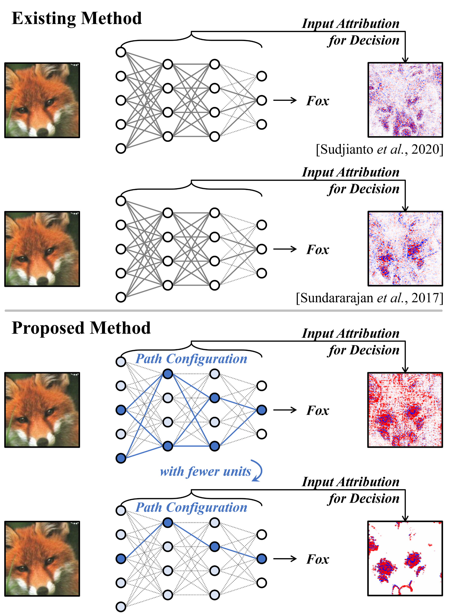

# Pathwise Explanation of ReLU Neural Networks


### Official Pytorch Implementation of [Pathwise Explanation of ReLU Neural Networks]()

<p align="center"></p>

---

# ⏩ Installation

* Create a conda environment (If you want, you can use a docker)
```
conda create -n pathwise_explanation python=3.8
conda activate pathwise_explanation
```

* Intall Package (Maybe other packages are needed to implement this code, so you just install them by pip, like "pip install [PACKAGE]" since their version is not important.)
```
conda install pytorch==1.11.0 torchvision==0.12.0 torchaudio==0.11.0 cudatoolkit=10.2 -c pytorch
conda install numpy==1.21.6
conda install matplotlib==3.5.1
conda install captum==0.6.0
conda install scikit-learn==1.3.0
pip install opencv-python==3.4.8.29
pip install opencv-contrib-python==3.4.8.29
pip install captum==0.6.0
```


# ⏩ Data Preparation
## Getting the Dataset
* Download the curated subset of ImageNet in the below link: 
    * [ImageNet_curatedSubset](https://drive.google.com/file/d/1pm-BFG8zwimca7d73Neb6N6b2lwg_DKw/view?usp=share_link)
* Unzip them in like below
~~~~
├── PathwiseExplanation
   ├── main.py
   ├── ...
   └── ILSVRC2012_selected_224/
~~~~

## Download pretrained weights
* Download in the below link:
   * [PretrainedWeights](https://drive.google.com/file/d/1hcza6DIK7_bBf4rZEaklhFkS-oGYeMes/view?usp=sharing)
* Place that in like below
~~~~
├── PathwiseExplanation
   ├── data
      └── ILSVRC2012_selected_224/
~~~~

# ⏩ Impletementation
* You can simply use the below line for all implementations of the proposed method according to depth and width.
```
bash run_imgSN_all.sh
```


## 👍 References
We referenced the repos below for implementing other methods or metrics.

* [RISE](https://github.com/eclique/RISE)
* [pytorch_cifar](https://github.com/kuangliu/pytorch-cifar)
